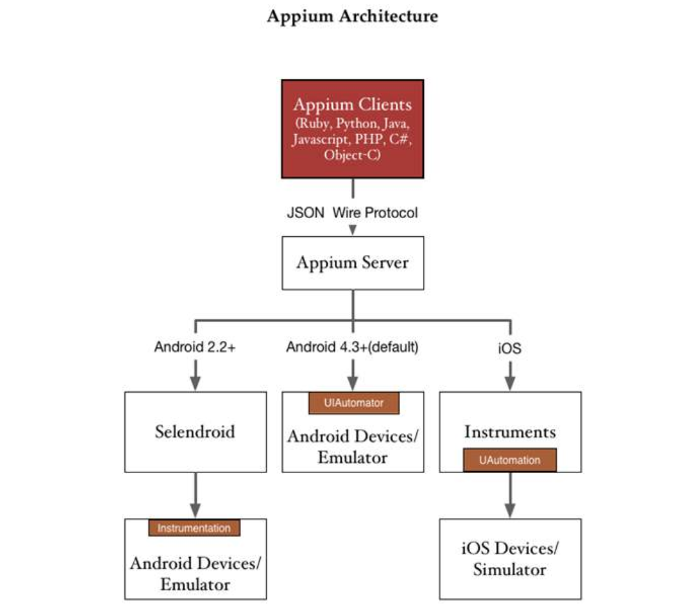
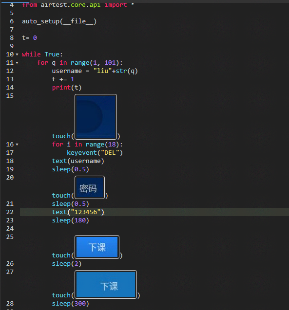

## 主流自动化测试框架
* 代码层自动化：即单元测试，Junit/PyUnit等
* 接口层自动化：即接口测试，Jmeter/LoadRunner/Postman等
* UI层自动化：Appium/selenium/winappdriver/Airtest

## UI自动化三部曲
* 启动被测app
* 定位并操作控件
* 检验操作结果
* 代码层自动化

## Appium框架
* 原理介绍：   

主要流程：  
脚本请求 ―> 4723端口Appium server ―> 解析参数给PC端4724端口 ―> 发送给设备4724端口 ―> 通过设备4724端口发给bootstrap.jar ―> Bootstrap.jar把命令发给uiautomator
* 安装：  
https://blog.csdn.net/gufenchen/article/details/91352512
* 官方文档：  
http://appium.io/docs/cn/about-appium/intro/
* 常用API：  
https://blog.csdn.net/ezreal_tao/article/details/80911950

## airtest：基于图像识别的测试框架
* demo：  

* 使用总结：  
1、尽量不要在控件操作中使用  
2、可在结果校验中使用  
3、识别图案过小容易识别失败  
4、同一个图片在不同分辨率设备上识别结果很可能不同  
5、截图尽量不要太多背景  

## pytest：启动和管理测试用例
* 编写规则：  
1、测试文件以test_开头（以_test结尾也可以）  
2、测试类以Test开头，并且不能带有 init 方法    
3、测试函数以test_开头
* pytest简单使用：  
https://www.jianshu.com/p/a754e3d47671
* pytest官方文档：  
https://learning-pytest.readthedocs.io/zh/latest/

